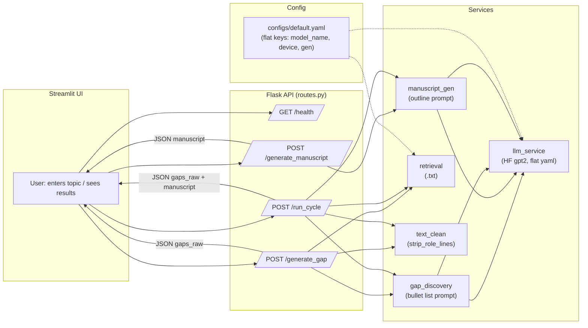

# Modular-AI-System

AI Research Assistant — Modular PoC

A proof-of-concept modular research agent that  
(1) discovers research gaps and  
(2) drafts a short manuscript,  
with the pipeline kept modular so components can be swapped independently. 

Design goal: Swap any module (e.g., move from GPT-2 to an API LLM) without breaking the rest of the chain.

## High-level overview ✨ 

Frontend UI: streamlit_app.py provides a minimal interface to run the end-to-end pipeline.  
Apis: flask server and api functions in /app.  
Modular Services: services/ holds small, composable units: text cleaning, retrieval, gap finding, manuscript drafting, critique/refine.  
Scripts: run flask server locally.  
Containerization: docker-compose.yml and docker/ provide a one-command local stack.  

## Architecture 🏗 

### Conceptual flow:

Streamlit UI → user selects topic & inputs seed text/PDFs  
Orchestrator (app/agent.py) → executes the pipeline steps  
gap_finder → extract open problems/research gaps  
manuscript → draft sections (abstract→method→discussion)  
Output surfaced back to UI  

## Quickstart (local) 🚀
Option A — Python
 1. Create venv  
python -m venv .venv && source .venv/bin/activate

 2. Install deps  
pip install -r requirements.txt

 3. Run the APIs  
API server: run_flask.bat || python -m app.server_flask  
streamlit UI: streamlit run streamlit_app.py

Option B — Docker  
docker compose up --build

The compose stack runs:  
&nbsp;ui → streamlit_app.py  
&nbsp;api → Python services + agent entrypoints  